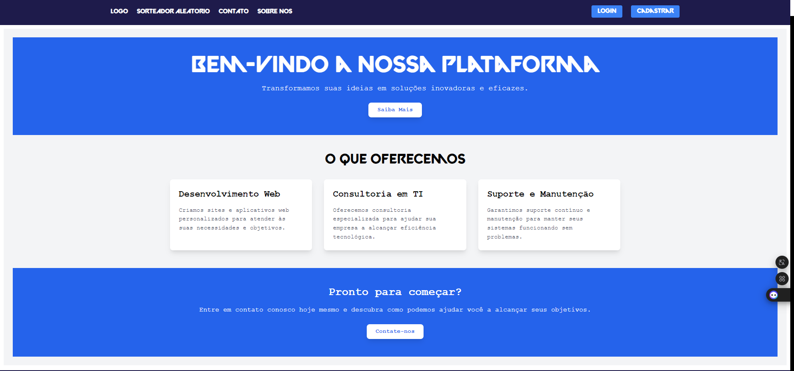
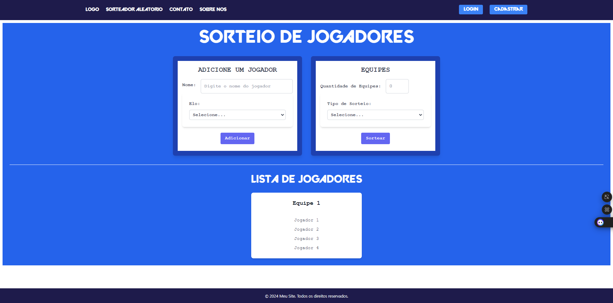
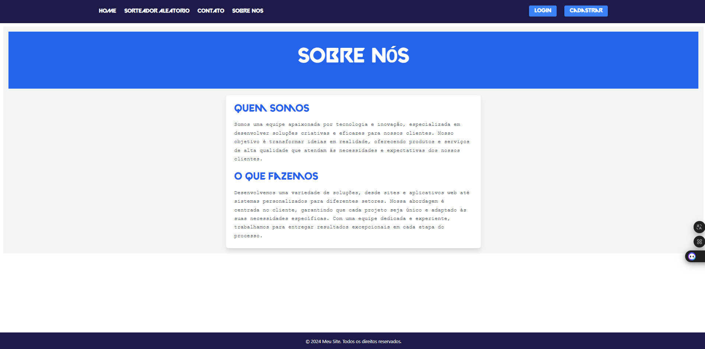
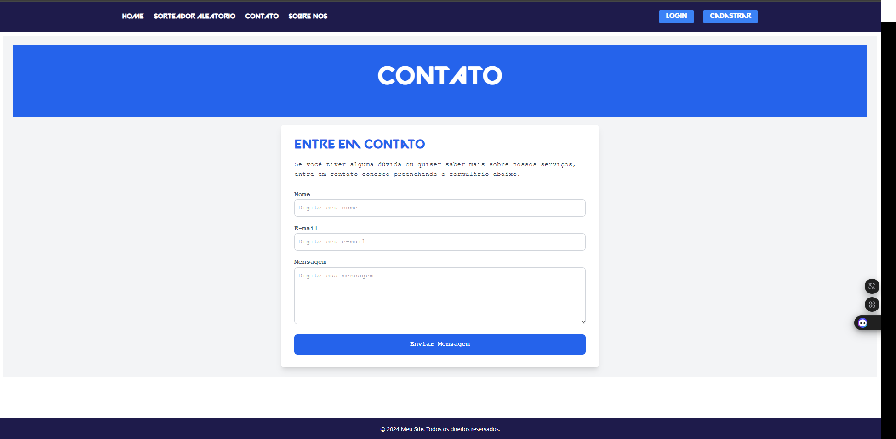

# CSV30

Este é um projeto de aplicação web desenvolvido com React no frontend e Node.js com Express no backend. A aplicação possui as seguintes páginas:

- **Home**: Página inicial da aplicação.
- **Sorteador Aleatório**: Ferramenta para sortear Jogadores aleatoriamente.
- **Sobre Nós**: Informações o projeto.
- **Contato**: Formulário para contato com a equipe.

## Estrutura do Projeto

A estrutura do projeto é dividida em duas partes principais:

1. **Frontend (React)**: Localizado no diretório `/`.
2. **Backend (Node.js/Express)**: Localizado no diretório `backend`.

### Frontend

O frontend é desenvolvido com React e está localizado no diretório `/`. Para começar a trabalhar no frontend, siga estes passos:

1. Navegue até o diretório `/`:

    ```bash
    cd frontend
    ```

2. Instale as dependências:

    ```bash
    npm install
    ```

3. Inicie o servidor de desenvolvimento:

    ```bash
    npm start
    ```

   A aplicação estará disponível em `http://localhost:3000`.

### Backend

O backend é desenvolvido com Node.js e Express e está localizado no diretório `backend`. Para começar a trabalhar no backend, siga estes passos:

1. Navegue até o diretório `backend`:

    ```bash
    cd backend
    ```

2. Instale as dependências:

    ```bash
    npm install
    ```

3. Inicie o servidor:

    ```bash
    npm start
    ```

   O servidor estará rodando em `http://localhost:5000`.

## Rotas

### Frontend

- **Home**: `http://localhost:3000/`

- **Sorteador Aleatório**: `http://localhost:3000/random-sort`

- **Sobre Nós**: `http://localhost:3000/about`

- **Contato**: `http://localhost:3000/contact`


### Backend

A aplicação backend não possui rotas específicas descritas no README. As rotas são configuradas de acordo com a necessidade e a implementação do projeto.

## Contato

Se você tiver alguma dúvida ou sugestão, entre em contato com a equipe através do formulário na página de contato ou pelo e-mail: [email@example.com](mailto:email@example.com).

